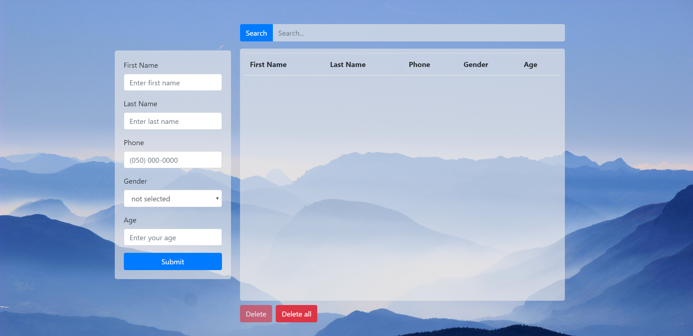
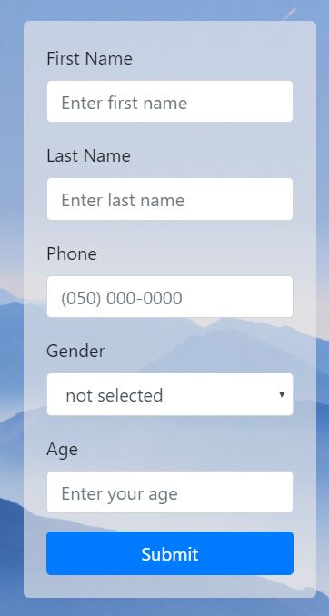
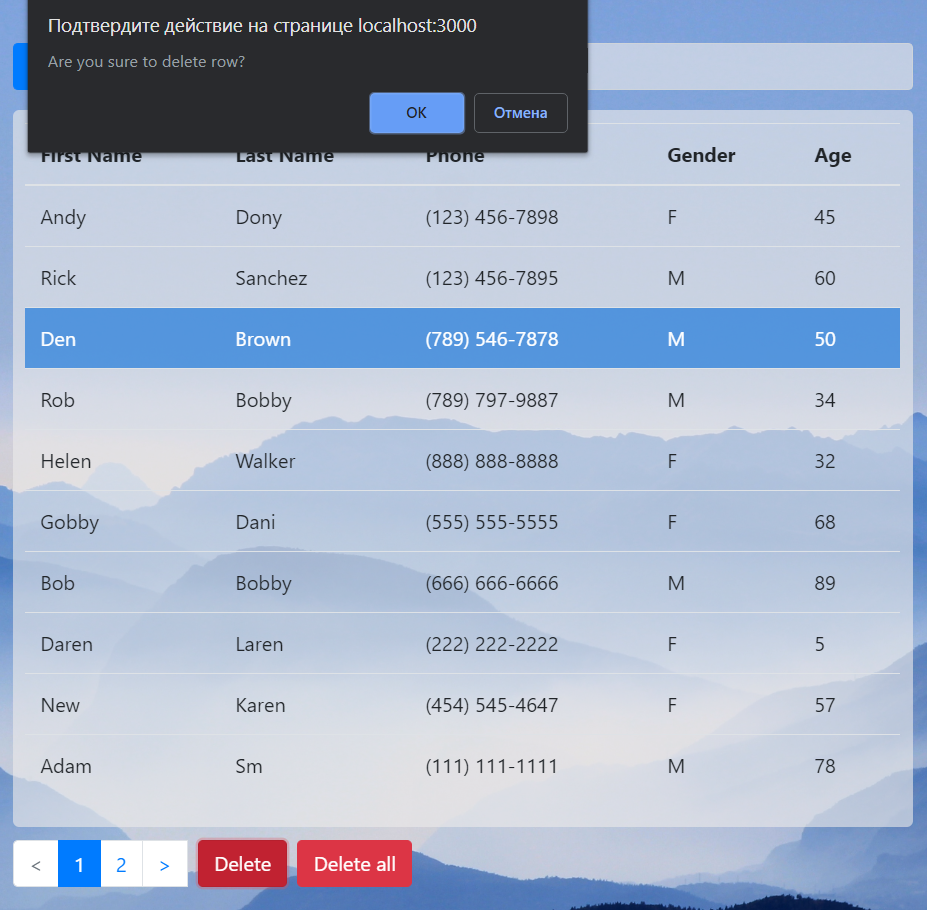
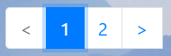

# USAGE GUIDE  
  
* Empty state  
  
  
### To add new row input data into the form and press **Submit** button:  
  
  
  
### To find certain row input search parameter into **Search field** and press **Search**  
  
  
  
### Click on the table headers to order data  
  
  
  
### To delete row select the row and then press **Delete**. To delete all rows click **Delete all**  
  
  
  
### Pagination appears if number of rows > 10  
  
     

